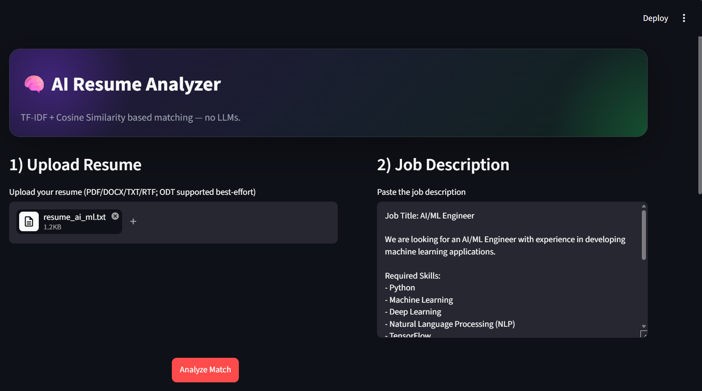
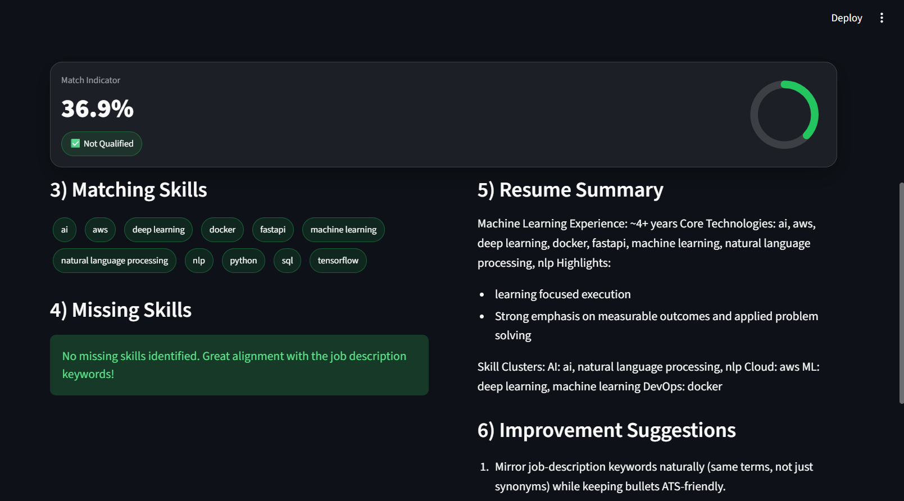
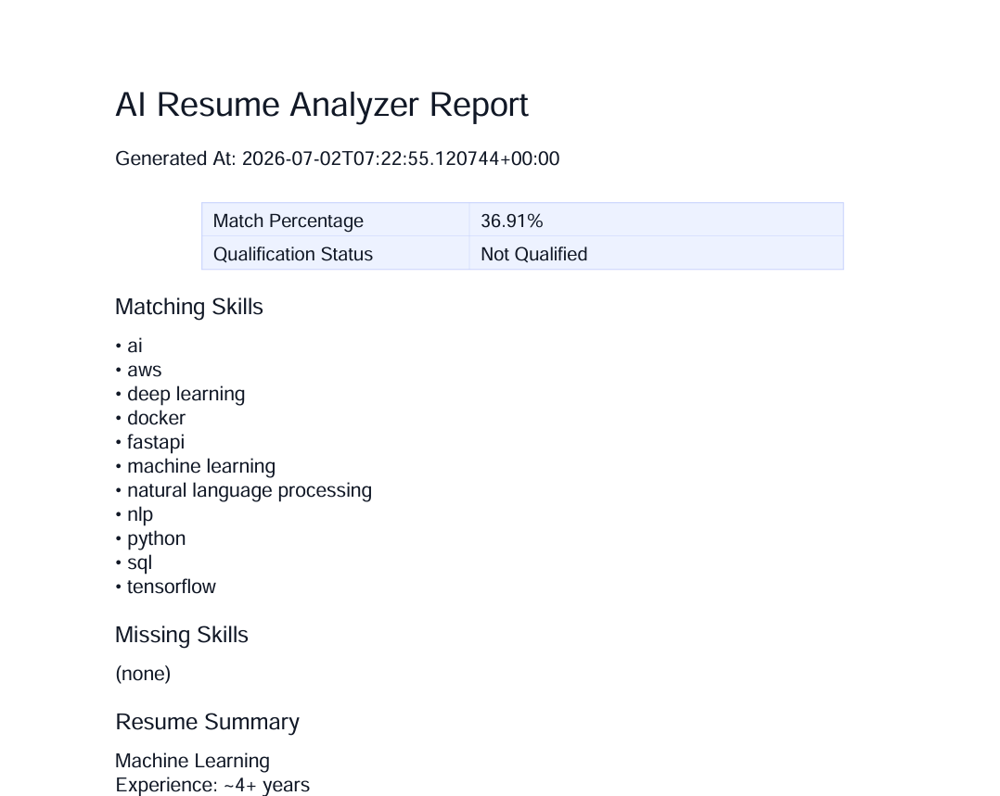

# AI Resume Analyzer (TF-IDF + Cosine Similarity)

A production-ready **Streamlit** application that analyzes how well a candidate resume matches a pasted job description using **TF-IDF** and **cosine similarity** (no LLMs).

## Features
- Upload resumes: **PDF, DOCX, TXT, RTF** (ODT supported best-effort)
- Extract text with specialized parsers
- NLP preprocessing with **NLTK** (tokenization, stopwords, lemmatization)
- **TF-IDF Vectorizer + Cosine Similarity** similarity scoring
- Qualification status: 
  - **Qualified**: score ≥ configurable threshold
  - **Partially Qualified**: between thresholds
  - **Not Qualified**: below minimum threshold
- Skill extraction using a built-in **300+ technical skills database**
- Matching skills / missing skills / extra skills
- Auto-generated resume summary and improvement recommendations
- Download a **PDF** analysis report
- Modern premium UI (glassmorphism, gradients, dark theme)

## Tech Stack
- Python
- Streamlit
- scikit-learn
- NumPy, pandas
- NLTK
- pdfplumber, PyPDF2
- python-docx
- regex
- reportlab (PDF report generation)

## Installation
```bash
python -m venv venv
venv\Scripts\activate
pip install -r requirements.txt
```

## Run
```bash
streamlit run app.py
```

## Project Structure
```text
resume_analyzer/
  app.py
  requirements.txt
  README.md
  uploads/
  reports/
  assets/
  src/
    utils.py
    preprocess.py
    resume_parser.py
    analyzer.py
    skills.py
    recommender.py
    report_generator.py
```

## Screenshots
# AI Resume Analyzer

## Home Page


---

## Upload Resume



---

## Analysis Result



---

## Download Report



-----

## local host link:

Local URL: http://localhost:8501

## Future Enhancements
- Improve skill extraction using supervised keyword weights
- Add additional resume fields (education, projects) parsing
- Add per-category similarity scoring
- Add multilingual support


